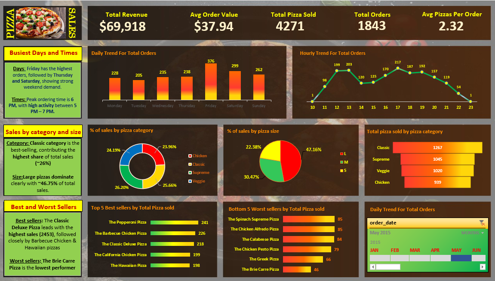
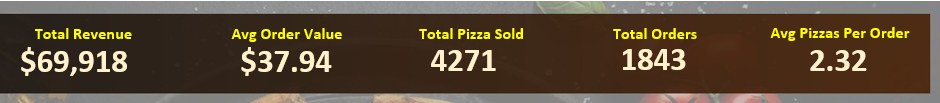
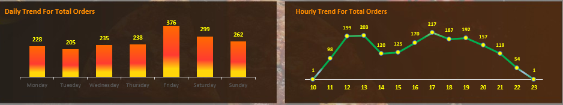
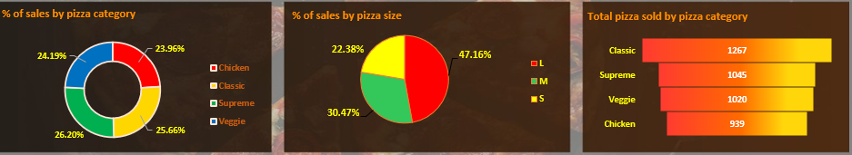
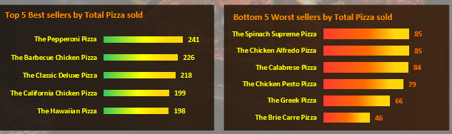

# Pizza Sales Excel Dashboard
Interactive Excel dashboard analyzing pizza sales performance

## Project Overview
This project presents an interactive Excel dashboard to analyze pizza sales performance, customer behavior, and product trends.

The dataset consists of **48,049 rows**, and the goal of this project is to derive actionable business insights related to revenue, order patterns, and product performance.

---

## Tools Used
- Microsoft Excel
- Pivot Tables
- Pivot Charts
- Slicers
- Formulas (TEXT, COUNTIF)

---

## Data Preparation & Cleaning
- Created a new column **order_day** using the `TEXT` formula to extract day names from dates for daily trend analysis  
- Used `COUNTIF` function to **remove duplicate order IDs** and calculate the correct total number of unique orders  
- Cleaned and structured the dataset for accurate analysis  

---

## Dashboard Features
- KPI cards for:
  - Total Revenue
  - Average Order Value
  - Total Orders
  - Total Pizza Sold
  - Average Pizzas per Order  

- Daily trend analysis of orders  
- Hourly order pattern analysis  
- Sales distribution by pizza category and size  
- Top 5 best-selling pizzas  
- Bottom 5 worst-selling pizzas  
- Interactive filtering using slicers  

---

## Dashboard Overview

---

## Key Visual Analysis

### KPI Summary

### Daily & Hourly Trends

### Sales Distribution

### Top & Bottom Sellers

---

## Key Insights
- Total revenue reached **$69,918**, indicating strong overall business performance  
- **Friday and weekends** show higher order volumes, highlighting peak demand periods  
- Peak ordering time is around **6 PM**, with high activity between **5 PM – 7 PM**  
- **Large pizzas dominate sales (~47%)**, indicating customer preference for larger sizes  
- Sales across pizza categories are relatively balanced, with **Classic category leading (~26%)**  
- A few top-selling pizzas contribute significantly to total sales, while some items show consistently low demand  
- Customer ordering patterns indicate both repeat purchases and peak-time buying behavior  

---

## File Included
- 'pizza_sales_dashboard.xlsx'

---

## Dataset Source
This dataset was sourced from publicly available learning resources and used for practice and portfolio purposes.

All data cleaning, dashboard design, formulas, and insights were created by me.

---

## Additional Work
- Designed a **custom background using PowerPoint** to enhance dashboard visualization and presentation quality  
- Focused on making the dashboard visually appealing and easy to interpret  

---

## Conclusion
This project demonstrates my ability to:
- Clean and prepare real-world datasets  
- Apply Excel formulas for data transformation  
- Build interactive dashboards  
- Derive meaningful business insights for decision-making  

